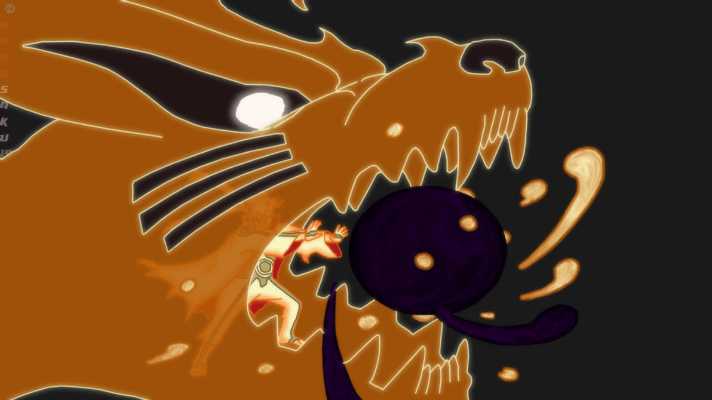
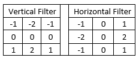
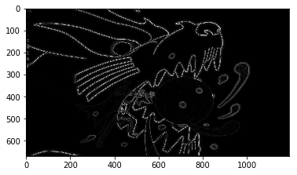

# Edge_Detection
## Introduction
Detecting edges of an anime scene to work through the basics of image processing. Eventually, the lessons picked up here will be used to assist a real-time object detection program on a raspberry pi device. 

## Image To Be Processed:

This image will first be converted to greyscale to reduce the complexity for passing the image through a filter.
Mathematically, the image's dimensions will be reduced from 3 tuples for RGB to 1 for greyscale; with each pixel having a value between 0 & 255.

## Sobel Filter:

The algorithm uses one filter at a time and starts on the top left of the image. The filter gets convoluted with a 3x3 matrix containing the image's greyscale values and then it moves the filter one pixel to the right; performing the same process. Once the filter reaches the end, it will move back to the left side of the picture, but one pixel below where the filtering started initially. This filtering process runs until the filter reaches the bottom right of the image.  

## Image After Processing:

Currently, the algorithm detects edges at the points where there is notable change in colour on the original image. 
